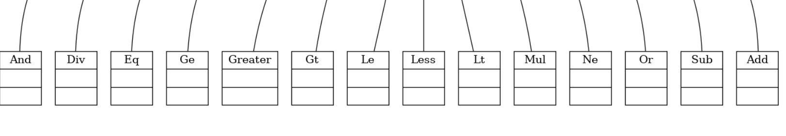
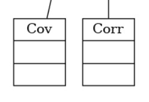
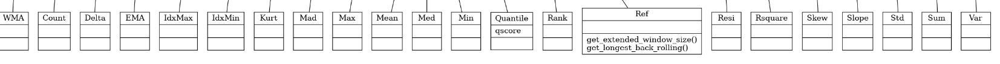
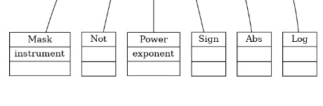
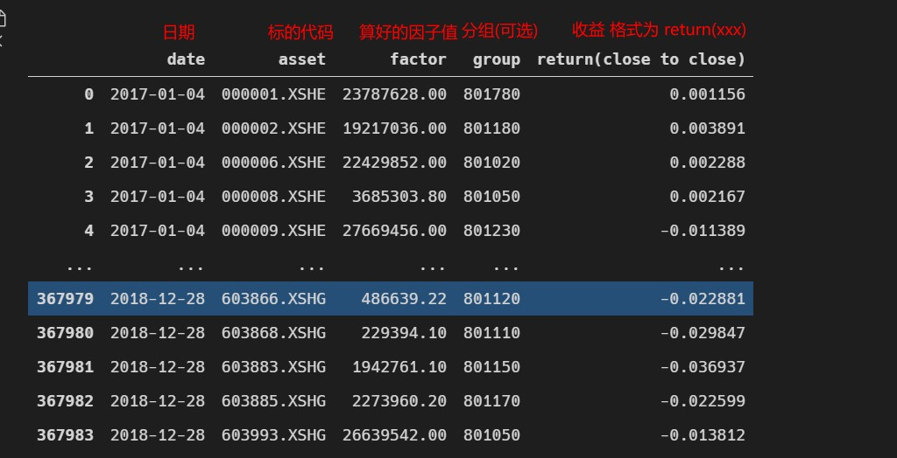

# alpha-pipe

## 源码级用户使用说明

### 注意

代码必须在bin目录下运行

### 下载

直接从github下载源码包即可(**zzb分支!!!!!!!**)

### 安装环境

#### 创建Python虚拟环境(推荐)

创建环境

```shell
python -m venv venv 
```

激活环境

linux

```shell
source venv/bin/activate
```

windows

```
cd venv/Scripts
./activate
```

#### 安装所需库

```shell
pip install -r requirements.txt
```

#### 编译pyx

```shell
python setup.py build_ext --inplace    
```

### 配置数据库

将data.zip解压即可


#### 因子测试

建议习惯用jupyter的用户,将test.py中的代码**按块**复制到.ipynb文件中运行

#### 基础因子

 - '$open','$close','$low','$high','$volume','$money','$factor' 日级别因子

 - '$open_x', '$close_x', '$low_x', '$high_x', '$volume_x', '$money_x', 其中 x ~ (1, 240) 分钟级别因子

#### 基础算子

<!-- 


 -->

- "> >= < <= == !="
- "+ - * /"
- "& |": and or
- Not: Not Operator
- Abs: Feature Absolute Value
- Sign: Feature Sign
- Log: Feature Log
- Power: Feature Power
- If: If($close>$open, $close, $open)
- Ref: Feature Reference, 类似pandas shift Ref($close, -1) 下一天的收盘价
- Mean: Rolling Mean (MA) Mean($close, 5)
- Sum: Rolling Sum Sum($close, 5)
- Std: Rolling Std. Std($close, 5)
- Var: Rolling Variance. Var($close, 5)
- Skew: Rolling Skewness. Skew($close, 10)
- Kurt: Rolling Kurtosis($close 10)
- Max: Rolling Max. Max($close, 10)
- IdxMax: Rolling Max Index. IdxMax($close, 10)
- IdxMin: Rolling Min Index. IdxMin($close, 10)
- Min: Rolling Min. Min($close, 10)
- Quantile: Rolling Quantile. Quantile($close, 10, 0.5) 过去十天 大于50% 收盘价的分位数
- Med: Rolling Median. Med($close, 10)
- Mad: Rolling Mean Absolute Deviation. Mad($close, 10)\
- Rank: Rolling Rank (Percentile). Rank($close, 10)
- Count: rolling count of number of non-NaN elements
- Delta: end minus start in rolling window. Delta($close, 10)
- Slope: linear regression slope of given window. Slope($close, 10)
- Resi: regression residuals of given window. Resi($close, 10)
- WMA: weighted moving average. WMA($close,10)
- EMA: Exponential Mean. EMA($close, 10)
- Corr: rolling correlation of two input features. Corr($close, $open, 10)
- Cov: Rolling Covariance. Cov($close, $open, 10)


### 测试设置字段

```python
config = {
    'market':'all', # 全市场, 目前指2017-01-01的中证800
    'start_time':'2017-01-01', # 测试开始日期
    'end_time':'2019-01-01', # 测试结束日期
    'periods':(1, 1), # 收益计算周期
    'quantile':5, # 分层数
    'factor_exp': '$open / Ref($close, 1) - 1', # 因子表达式
    'ret_exps':['$open', 'Ref($close, 1)'], # 收益表达式
    'ret_types':['open','Ref($close, 1)'], # 收益表达式的名称
    'provider_uri':'./data/bin_data', # 数据路径
    'region':REG_CN # 市场的类型, A股
}

# len(periods) len(ret_exps) len(ret_types) 必须对应且长度相同!!!!!!
```

### 支持自定义因子数据 (见/bin/df_test.py)

用户将因子值算好并打包为 pandas DataFrame 格式 使用DFTest进行单因子测试

因子的格式必须严格为


